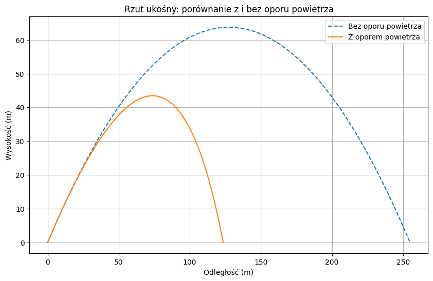

# Fizyka kwantowa

## Równanie Schrödingera

Równanie Schrödingera jest jednym z podstawowych równań mechaniki kwantowej. Opisuje ewolucję czasową stanu kwantowego.

### Równanie Schrödingera zależne od czasu

Stan cząstki w reprezentacji położeniowej opisujemy za pomocą funkcji falowej $\Psi(\vec{r},t)$, która zależy od położenia i czasu.

**Równanie Schrödingera zależne od czasu** ma postać:

$$
i\hbar \frac{\partial}{\partial t}\Psi(\vec{r},t)
= \hat{H}\Psi(\vec{r},t)
$$

W równaniu występują następujące wielkości:

| Symbol | Znaczenie |
|---|---|
| $i$ | Jednostka urojona |
| $\hbar$ | Zredukowana stała Plancka |
| $\Psi(\vec{r},t)$ | Funkcja falowa |
| $\hat{H}$ | Operator Hamiltona |
| $\vec{r}$ | Wektor położenia |
| $t$ | Czas |

### Operator Hamiltona

Operator Hamiltona odpowiada obserwabli energii całkowitej układu kwantowego.

Dla pojedynczej nierelatywistycznej cząstki o masie $m$, poruszającej się w potencjale $V(\vec{r},t)$, Hamiltonian ma postać:

$$
\hat{H}=-\frac{\hbar^2}{2m}\nabla^2+V(\vec{r},t)
$$

Pierwszy składnik opisuje *energię kinetyczną*, natomiast drugi odpowiada energii potencjalnej.

Dla cząstki swobodnej przyjmujemy $V(\vec{r},t)=0$.

### Interpretacja funkcji falowej

Zgodnie z **interpretacją Borna**, kwadrat modułu funkcji falowej określa gęstość prawdopodobieństwa znalezienia cząstki w określonym położeniu.

Gęstość prawdopodobieństwa wynosi $\rho(\vec{r},t)=|\Psi(\vec{r},t)|^2$.

Dla znormalizowanej funkcji falowej zachodzi:

$$
\int_{\mathbb{R}^3}|\Psi(\vec{r},t)|^2\,d^3r=1
$$

Oznacza to, że całkowite prawdopodobieństwo znalezienia cząstki w przestrzeni wynosi jeden.

## Podstawowe zagadnienia mechaniki kwantowej

Najważniejsze pojęcia omawiane w tym dokumencie:

- Funkcja falowa
- Równanie Schrödingera
- Operator Hamiltona
- Interpretacja Borna

Przykładowa kolejność rozwiązywania problemu kwantowego:

1. Określenie potencjału i Hamiltonianu.
2. Sformułowanie równania Schrödingera.
3. Wyznaczenie funkcji falowej.
4. Normalizacja funkcji falowej.
5. Obliczenie interesujących wielkości fizycznych.

### Lista kontrolna

- [x] Wprowadzenie równania Schrödingera
- [x] Definicja operatora Hamiltona
- [x] Interpretacja funkcji falowej
- [ ] Rozwiązanie równania dla cząstki w studni potencjału
- [ ] Analiza wartości oczekiwanych obserwabli

## Przykład obliczeniowy w Pythonie

Poniższy program oblicza energię kinetyczną swobodnego elektronu dla zadanej długości fali de Broglie'a.

```python
import numpy as np

hbar = 1.054571817e-34  # J*s
m_e = 9.1093837139e-31  # kg
lam = 1e-10  # m

k = 2 * np.pi / lam
E = hbar**2 * k**2 / (2 * m_e)

print("Energia kinetyczna:", E, "J")
print("Energia kinetyczna:", E / 1.602176634e-19, "eV")
```

Kod można uruchomić w środowisku [Google Colab](http://colab.research.google.com).

## Wizualizacja

Poniżej przedstawiono przykładowy wykres:



## Podsumowanie

Równanie Schrödingera opisuje ewolucję czasową stanu kwantowego. Operator Hamiltona jest związany z energią układu, a interpretacja Borna pozwala wyznaczać prawdopodobieństwa wyników pomiaru położenia.

W mechanice kwantowej nie można utożsamiać funkcji falowej z klasyczną trajektorią cząstki.

~~Funkcja falowa jednoznacznie określa klasyczną trajektorię cząstki.~~

Powyższe stwierdzenie jest niepoprawne w standardowym formalizmie mechaniki kwantowej.

